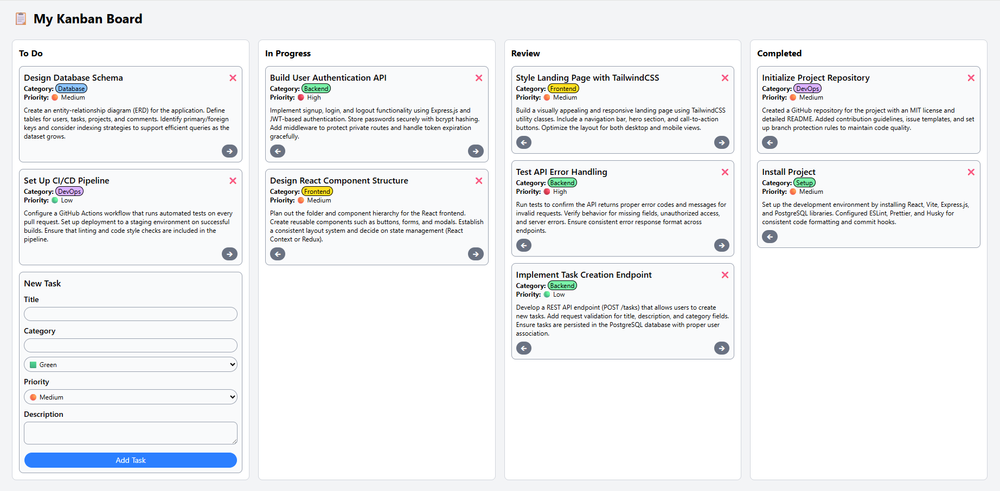

# Kanban Board React

<!-- TABLE OF CONTENTS -->
<details>
  <summary>Table of Contents</summary>
  <ol>
    <li>
      <a href="#about-the-project">About The Project</a>
      <ul>
        <li><a href="#key-features">Key Features</a></li>
        <li><a href="#built-with">Built With</a></li>
      </ul>
    </li>
    <li>
      <a href="#docker-deployment">Docker Deployment</a>
    </li>
  </ol>
</details>

## About The Project



__Kanban Board React__ is an application that lets users create tasks, organize them into four lanes (To Do, In Progress, Review, Completed), and move tasks forward or backward between lanes. It uses __Vite__ as a built tool and __React__ state with localStorage persistence, __TailwindCSS__ for styling, and is built from modular components (`Task`, `TaskForm`, `TaskList`, `Lane`) for reusability. A Dockerfile is provided for easy deployment. 

### Key Features

- __Task Management__: Add new tasks via a task form component. A task has the following attributes: _title_, _category_, _priority_, and _description_. Each task card is styled with Tailwind (rounded corners, dynamic styling, centered layout).
- __Kanban Lanes__: There are four workflow stages: _To Do_, _In Progress_, _Review_, and _Completed_. Tasks are displayed in their corresponding lane.
- __Task Movement__: Each task has forward and backward buttons to move between lanes. Movement is restricted (e.g. can’t move backward from _To Do_ or forward from _Completed_).
- __Persistence__: Users create tasks using a form and delete them using a delete button. To make the experience seamless, all task actions, including adding, moving, and deleting, are persisted with the browser's localStorage. This ensures that the board's state is saved across browser sessions. When users refresh the page or return later, their tasks remain exactly where they left them, without requiring a backend database. 

### Built With

* [![JavaScript][JavaScript]][JavaScript-url]
* [![Tailwind][Tailwind]][Tailwind-url]
* [![React][React]][React-url]
* [![Vite][Vite]][Vite-url]
* [![Docker][Docker]][Docker-url]

## Docker Deployment

To maintain consistent deployment, the application is containeraized using Docker. The `docker build` and `docker run` commands are encapsulated in a Makefile for convenience. 

```bash
make docker-build
make docker-run
```

When deployed locally, open browser at `localhost:8080`. 

<!-- MARKDOWN LINKS & IMAGES -->

[JavaScript]: https://shields.io/badge/JavaScript-F7DF1E?logo=JavaScript&logoColor=000&style=flat-square
[JavaScript-url]: https://developer.mozilla.org/en-US/docs/Web/JavaScript
[React]: https://img.shields.io/badge/-ReactJs-61DAFB?logo=react&logoColor=white&style=for-the-badge
[React-url]: https://react.dev/
[Vite]: https://img.shields.io/badge/Vite-646CFF?style=for-the-badge&logo=Vite&logoColor=white
[Vite-url]: https://vite.dev/
[Docker]: https://img.shields.io/badge/docker-257bd6?style=for-the-badge&logo=docker&logoColor=white
[Docker-url]: https://www.docker.com/
[Tailwind]: https://img.shields.io/badge/Tailwind_CSS-grey?style=for-the-badge&logo=tailwind-css&logoColor=38B2AC
[Tailwind-url]: https://tailwindcss.com/

